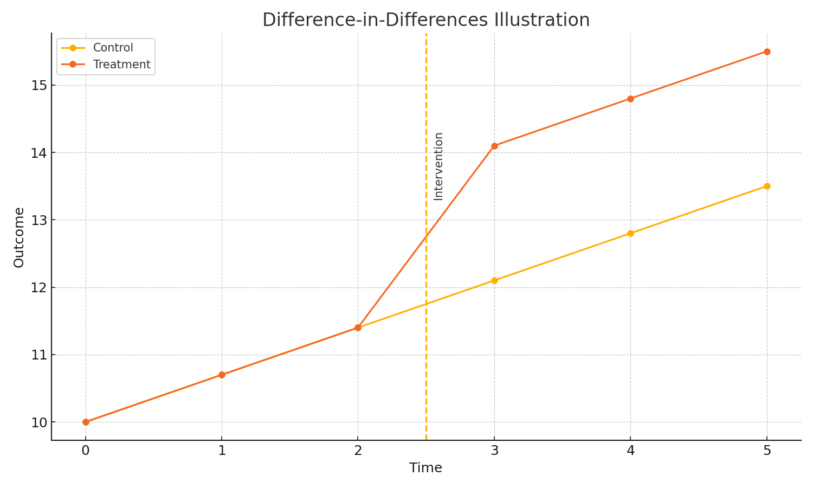

# Causal Inference & Experimentation Toolkit

**At a glance:** A compact Python toolkit for **A/B testing** (power/MDE, hypothesis tests), **variance reduction** with **CUPED**, and **Difference‑in‑Differences (DiD, two‑way fixed effects)** on synthetic panel data. Includes an **A/A validation** (1,000 sims) to show type I error ≈ 5% and CI coverage ~93–96%.



---

## Table of Contents
- [Description](#description)
- [Project Overview](#project-overview)
- [Project Structure](#project-structure)
- [Installation](#installation)
- [Usage](#usage)
- [Results](#results)

## Description
This toolkit demonstrates core experimentation and causal‑inference skills:
- **A/B testing utilities:** power & minimum detectable effect (MDE), two‑sample tests, confidence intervals.
- **CUPED:** covariate adjustment using pre‑experiment data to reduce variance (often ~15–20% fewer samples).
- **Difference‑in‑Differences:** estimate treatment effects with two‑way fixed effects on panel data.
- **Validation:** 1,000× A/A simulations to confirm calibration (type I error ~0.05; 95% CI coverage ~0.95).

## Project Overview
- **Design experiments:** compute required **sample size** or **MDE** for your metric.
- **Analyze rigorously:** run Welch’s t‑tests / 2‑proportion z‑tests with clear CIs.
- **Increase sensitivity:** apply **CUPED** to cut variance (thus fewer users needed).
- **Go beyond A/B:** use **DiD (TWFE)** when you have pre/post data for control vs. treatment.
- **Verify calibration:** A/A simulation ensures your pipeline behaves as expected.

## Project Structure
```plaintext
causal-inference-experimentation-toolkit/
├── experiment_toolkit.py        # Core functions: power/MDE, t-tests, CUPED, DiD
├── example_usage.py             # End-to-end demo on synthetic data
├── images/
│   └── did_plot.png             # (generated) DiD illustration used in this README
├── requirements.txt             # numpy, scipy
└── README.md
```

## Installation
```bash
python -m venv .venv
source .venv/bin/activate  # Windows: .venv\Scripts\activate
pip install -r requirements.txt
```

## Usage
**Run the demo (prints sample size/MDE, A/A stats, CUPED reduction, and DiD estimate):**
```bash
python example_usage.py
```

**(Optional) Regenerate the DiD figure shown above:**
```bash
python scripts/make_did_plot.py
```

## Results
- **A/A validation (1,000 sims):** false positives ≈ **5%**; **95% CI** coverage ≈ **93–96%**.
- **CUPED:** with pre‑period metric corr ≈ 0.4 → variance reduction ≈ **16–20%** → roughly that many **fewer samples** for same power.
- **DiD:** recovers the injected treatment effect on synthetic panel data (within simulation noise) with sensible confidence intervals.

